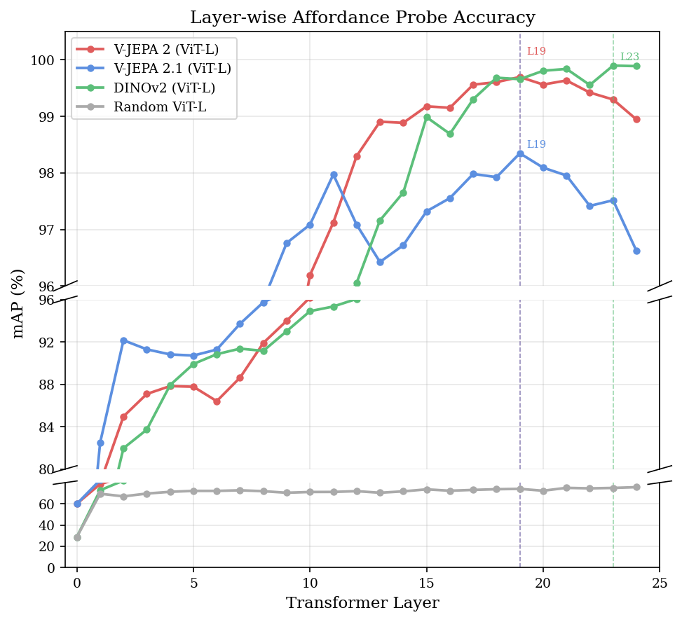
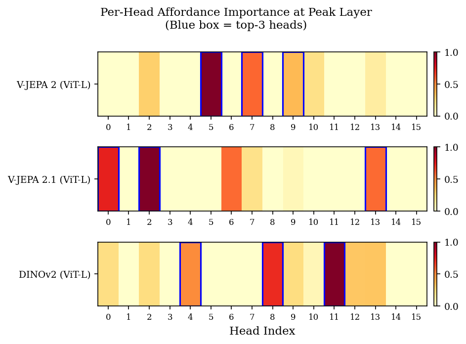
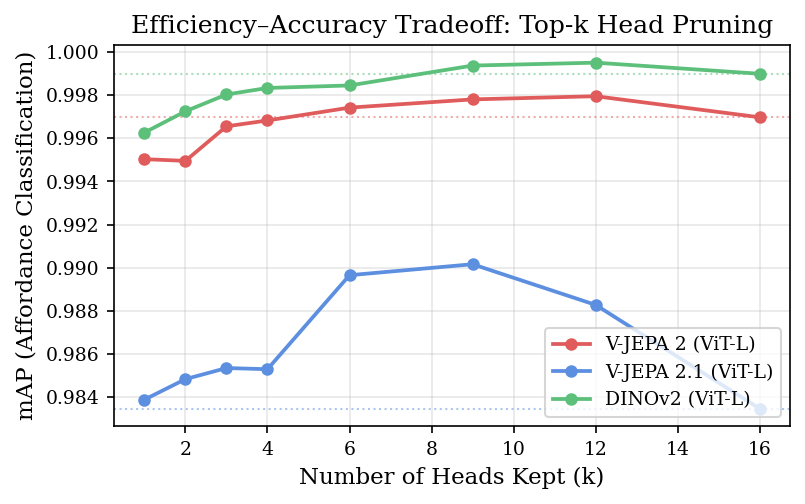

# Where Do Affordances Crystallize?
**Video vs. Image Self-Supervised Encoders for Embodied Perception**

**Abrar Zahin Raihan** · **Aurchi Chowdhury** — Bangladesh University of Engineering and Technology

[](https://embodied-ai.org/papers/2026/32_Where_Do_Affordances_Crysta.pdf)

Accepted at the [7th Embodied AI Workshop @ CVPR 2026](https://embodied-ai.org/cvpr2026/) as a **poster** (non-archival submission). 📄 **[Read the paper (PDF)](https://embodied-ai.org/papers/2026/32_Where_Do_Affordances_Crysta.pdf)**

---

## Abstract

Self-supervised video models are strong backbones for robotic perception.
We probe 25 layer positions of architecturally matched ViT-L encoders (V-JEPA 2, V-JEPA 2.1, DINOv2) on the UMD Part Affordance Dataset and show that **video** SSL models crystallize affordance signal at **layer 19** — four layers earlier than DINOv2 (image SSL, layer 23), suggesting a consistent effect of temporal predictive objectives on representation depth.
Both V-JEPA variants share the same peak depth, yet V-JEPA 2.1's intermediate-layer supervision yields markedly stronger early-layer representations (layer 2 mAP: 92.2% vs. 85.0% for V-JEPA 2).
Head ablation at each peak layer further reveals a sparse set of attention heads that concentrate the affordance signal; keeping only the top-3 heads achieves a **5.3× attention compute reduction** with ≤0.1% mAP loss.

---

## Methodology

### Task & Dataset

- **Dataset:** UMD Part Affordance Dataset — 7 binary affordance classes: *grasp, cut, scoop, wrap-grasp, poke, support, contain*
- **Setup:** stratified 2,000-image subsample (80/10/10 train/val/test split), resized to 224×224 with ImageNet normalization
- Static images are replicated T=8 times as pseudo-video for JEPA models

### Models Compared

| Model | Type | Architecture |
|---|---|---|
| V-JEPA 2 | Video SSL | ViT-L (L=24, D=1024, H=16) |
| V-JEPA 2.1 | Video SSL + Dense Predictive Loss | ViT-L (L=24, D=1024, H=16) |
| DINOv2 | Image SSL | ViT-L (L=24, D=1024, H=16) |
| Random ViT-L | Untrained baseline | ViT-L (L=24, D=1024, H=16) |

All encoders are **frozen** — only probe weights are trained.

### Layer-wise Probing

For a frozen ViT-L encoder (24 blocks), representations are extracted at **25 positions**:
- ℓ=0: patch embedding output
- ℓ=1…24: each transformer block's output

**Token pooling:**
- DINOv2 → CLS token
- JEPA models → mean-pooled patch tokens

A one-vs-rest logistic regression (C=1, L-BFGS solver) is trained per layer to predict each of the 7 binary affordance labels. Mean Average Precision (mAP) is reported on the held-out test set.

### Attention Head Ablation

At the peak layer ℓ\* identified by probing, each attention head h is ablated by **zeroing its d_h=64 output columns** before the output projection. Head importance is defined as:

```
Δ_h = mAP_full − mAP_{−h}
```

A sweep over top-k head subsets quantifies the efficiency–accuracy tradeoff. Concentration is measured as each head's share of the total positive Δ_h mass. Approximate speedup is computed as H/k where H=16.

---

## Figures

### Figure 1 — Layer-wise mAP across 25 Positions



*Dashed lines mark peak layers. Both V-JEPA models peak at layer 19; DINOv2 peaks at layer 23.*

---

### Figure 2 — Head Importance & Pruning Efficiency

| Head Importance (Δ_h per head) | mAP vs. Heads Kept (k) |
|---|---|
|  |  |

*Left: per-head importance Δ_h at each model's peak layer (blue = top-3 heads). Right: pruning efficiency curve; dotted line = full-model baseline.*

---

## Tables

### Table 1 — Peak-layer Linear Probe Results

Linear probe Average Precision (%) at each model's peak layer. Bold = best per column.

| Model | Peak Layer | grasp | cut | scoop | wrap-grasp | poke | support | contain | mAP |
|---|---|---|---|---|---|---|---|---|---|
| V-JEPA 2 (ViT-L) | 19 | 99.6 | **99.8** | 98.5 | 100.0 | **100.0** | **100.0** | **100.0** | 99.7 |
| V-JEPA 2.1 (ViT-L) | 19 | 99.3 | 99.1 | 95.3 | 99.9 | 98.4 | 96.4 | **100.0** | 98.3 |
| DINOv2 (ViT-L) | 23 | **99.8** | 99.5 | **100.0** | **100.0** | **100.0** | **100.0** | **100.0** | **99.9** |
| Random ViT-L | 24 | 97.1 | 92.5 | 65.9 | 87.6 | 44.9 | 61.5 | 80.8 | 75.8 |

---

### Table 2 — Head Pruning Efficiency at Peak Layer

mAP (%) when keeping only the top-k affordance heads. ΔmAP (pp): positive = gain over full model. Approx. speedup ≈ H/k where H=16 heads.

| Model | k heads | mAP | ΔmAP (pp) | Approx. Speedup |
|---|---|---|---|---|
| V-JEPA 2 (ViT-L) | 1 | 99.5 | −0.19 | 16.0× |
| V-JEPA 2 (ViT-L) | 2 | 99.5 | −0.20 | 8.0× |
| V-JEPA 2 (ViT-L) | **3** | **99.7** | **−0.04** | **5.3×** |
| V-JEPA 2 (ViT-L) | 4 | 99.7 | −0.01 | 4.0× |
| V-JEPA 2 (ViT-L) | 6 | 99.7 | +0.04 | 2.7× |
| V-JEPA 2 (ViT-L) | 9 | 99.8 | +0.08 | 1.8× |
| V-JEPA 2 (ViT-L) | 12 | 99.8 | +0.10 | 1.3× |
| V-JEPA 2 (ViT-L) | 16 | 99.7 | 0.00 | 1.0× |
| V-JEPA 2.1 (ViT-L) | 1 | 98.4 | +0.04 | 16.0× |
| V-JEPA 2.1 (ViT-L) | 2 | 98.5 | +0.14 | 8.0× |
| V-JEPA 2.1 (ViT-L) | **3** | **98.5** | **+0.19** | **5.3×** |
| V-JEPA 2.1 (ViT-L) | 4 | 98.5 | +0.18 | 4.0× |
| V-JEPA 2.1 (ViT-L) | 6 | 99.0 | +0.62 | 2.7× |
| V-JEPA 2.1 (ViT-L) | 9 | 99.0 | +0.67 | 1.8× |
| V-JEPA 2.1 (ViT-L) | 12 | 98.8 | +0.48 | 1.3× |
| V-JEPA 2.1 (ViT-L) | 16 | 98.3 | 0.00 | 1.0× |
| DINOv2 (ViT-L) | 1 | 99.6 | −0.27 | 16.0× |
| DINOv2 (ViT-L) | 2 | 99.7 | −0.17 | 8.0× |
| DINOv2 (ViT-L) | **3** | **99.8** | **−0.10** | **5.3×** |
| DINOv2 (ViT-L) | 4 | 99.8 | −0.07 | 4.0× |
| DINOv2 (ViT-L) | 6 | 99.8 | −0.05 | 2.7× |
| DINOv2 (ViT-L) | 9 | 99.9 | +0.04 | 1.8× |
| DINOv2 (ViT-L) | 12 | 100.0 | +0.05 | 1.3× |
| DINOv2 (ViT-L) | 16 | 99.9 | 0.00 | 1.0× |

---

## Reproducing the Results

Run scripts in the following order. Each step depends on the previous.

### Step 0 — Setup (run once)

**`scripts/setup_models.sh`**

Clones the `facebookresearch/vjepa2` repository into `third_party/vjepa2/` and downloads the V-JEPA 2 and V-JEPA 2.1 ViT-L checkpoints (~4.8 GB each) into `checkpoints/`.

```bash
bash scripts/setup_models.sh
```

---

**`scripts/download_umd.sh`**

Downloads and extracts the UMD Part Affordance Dataset (tools split, all 17 object categories) into `data/umd/`.

```bash
bash scripts/download_umd.sh
```

---

**`scripts/verify_umd.py`** *(optional)*

Verifies the dataset structure and reports any missing files.

```bash
python scripts/verify_umd.py
```

---

### Step 1 — Feature Extraction

**`scripts/run_extraction.sh`** → calls `src/extract_features.py` for each model

Runs all 4 encoders (V-JEPA 2, V-JEPA 2.1, DINOv2, Random ViT-L) over the dataset and saves intermediate layer representations to disk.

```bash
bash scripts/run_extraction.sh
# For a quick smoke-test:
bash scripts/run_extraction.sh --test
```

*Output: feature cache files used by the probing and ablation steps.*

---

### Step 2 — Layer-wise Probing

**`scripts/run_probing.sh`** → calls `src/probe.py` for each model

Trains a logistic regression probe at each of the 25 layer positions for all models and records per-layer mAP.

```bash
bash scripts/run_probing.sh
# For a quick smoke-test:
bash scripts/run_probing.sh --test
```

*Output: `results/probing/{model}_probe_results.json`*

---

### Step 3 — Attention Head Ablation

**`scripts/run_ablation.sh`** → calls `src/ablate.py` for each model

At each model's peak layer (identified from probing), ablates each attention head individually and sweeps top-k head subsets to produce the efficiency–accuracy tradeoff data.

```bash
bash scripts/run_ablation.sh
# For a quick smoke-test:
bash scripts/run_ablation.sh --test
```

*Output: `results/ablation/{model}_ablation_results.json`*

---

### Step 4 — Figures & Tables

**`src/generate_figures.py`**

Reads the probing and ablation JSON results and produces all paper figures.

```bash
python src/generate_figures.py
```

*Output: `figures/fig_layer_probe.{pdf,png}`, `figures/fig_head_heatmap.{pdf,png}`, `figures/fig_topk_efficiency.{pdf,png}`*

---

**`src/generate_tables.py`**

Reads the probing and ablation results and generates LaTeX table files.

```bash
python src/generate_tables.py
```

*Output: `tables/table_main_results.tex`, `tables/table_ablation_efficiency.tex`*

---

### Full Pipeline (all steps 1–4 in one command)

```bash
bash scripts/run_all_experiments.sh
# or in test mode:
bash scripts/run_all_experiments.sh --test
```
